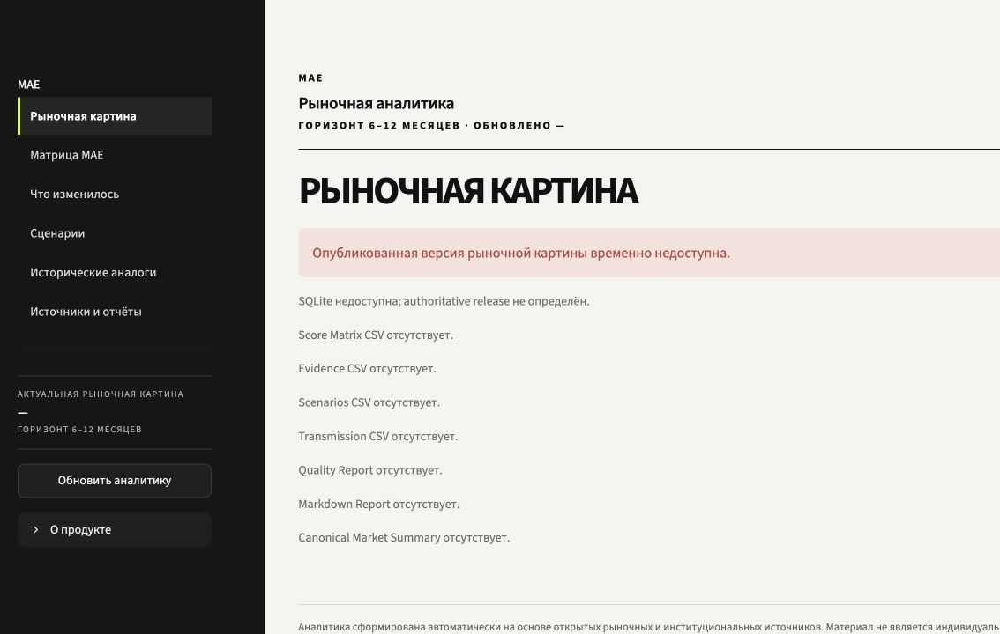

# MAE Research & Shift Signal MVP

A Streamlit research application for organizing market views, scenario evidence and changes across an asset/region matrix.

**Internship portfolio · Python + Streamlit · Sanitized source release**

> **Public-release boundary:** the application source is included, but private research snapshots, databases and workbook templates are excluded. The UI boots into an honest missing-data state. This is a source-code portfolio, not a populated market-data demo.

## Problem
Research publications, market views and scenario assumptions need a traceable path into a consistent market overview. Missing evidence and stale research should remain visible instead of becoming an apparently reliable score.

## Approach
`Publication → structured research view → change tracking → BASE / UPSIDE / DOWNSIDE scenarios → evidence checks → shift signal → MAE matrix`

The repository separates Streamlit pages, SQLAlchemy persistence, domain models, service logic and exports. It also contains snapshot/release services that distinguish available, validated and unavailable data.

## Stack
Python 3.12, Streamlit, SQLAlchemy, SQLite/PostgreSQL, Pydantic, pandas, NumPy, openpyxl, HTTP clients, pytest. An optional provider module integrates OpenAI; no API calls or credentials are needed for the public checks.

## Key Features
Features visible in the retained source (full data-dependent workflows require excluded inputs):
- Market overview, MAE matrix, change tracking, scenarios, historical analogs and source/report pages.
- A 19 × 6 asset/region matrix model and separate baseline/current/fresh-coverage logic.
- Structured validation and explicit source/evidence status.
- Bounded scoring, materiality, evidence rules and temporal metadata.
- SQLAlchemy models, immutable snapshot records and atomic release logic.
- CSV/XLSX/JSON export implementations.
- Read-only public mode and explicit missing-data handling.

## Results
- **9 existing self-contained tests passed** for business rules and the mocked provider contract.
- All **six UI routes** executed without uncaught exceptions in Streamlit AppTest after restoring two non-client configuration files.
- Data-dependent routes display missing-snapshot messages, as expected for this sanitized release.
- No live provider, populated 114-cell matrix, full pipeline or deployment was validated in this public package.
- No invented accuracy, alpha, productivity or user-adoption metrics.

## My Contribution
My internship project focused on turning a market-research workflow into a Streamlit application: organizing research views, scenarios and evidence; connecting the interface to persistence and service logic; and implementing data-quality checks and exports. The retained code shows these components and their separation into UI, models, services and repositories.

This describes the project contribution evidenced by the available implementation, not sole authorship of every line. New portfolio documentation and screenshots are separated from the internship source in [provenance](docs/CONTRIBUTION.md).

## How to Run
Use **Python 3.12** (the original project excludes Python 3.13 because of its Streamlit/PyArrow runtime).

```bash
python3.12 -m venv .venv
source .venv/bin/activate
python -m pip install -r requirements.txt
cp .env.example .env
python -m streamlit run app/main.py
```
On Windows, activate with `.venv\Scripts\activate` and copy `.env.example` to `.env` using File Explorer or PowerShell. Open the local URL printed by Streamlit.

The example environment enables read-only public mode. Do not add an API key to run this portfolio. Private `data/mae.db`, research snapshots and the original workbook are intentionally absent. Their absence is displayed by the original UI; this is not a setup error to fix with invented market data.

### Tests
```bash
python -m pytest -q
```
The dependency pins were recovered from the original repository. Validation used the existing Python 3.12 environment; installation into a brand-new environment was not repeated.

## Screenshots / Demo


The screenshot is from this sanitized build. There is no public hosted deployment or populated research demo in this release. Existing private screenshots were not published.

## Repository structure
```text
app/main.py         Original Streamlit entry point
app/ui/             Pages and display components
app/domain/         Domain enums, models and schemas
app/repositories/   Database layer
app/services/       Research, evidence, matrix and release logic
app/llm/            Optional provider integration
app/exporters/      Export implementations
migrations/         Original migration code
scripts/            Recovered maintenance/build scripts (some need private inputs)
data/               Two non-client method/configuration files only
tests/              Original self-contained business/provider tests
docs/               Limitations, provenance and screenshot
```

See [limitations](docs/LIMITATIONS.md) and [sanitization](docs/SANITIZATION.md) before interpreting this as an end-to-end reproducible application. This portfolio is not a trading strategy or a validated return-prediction system.
